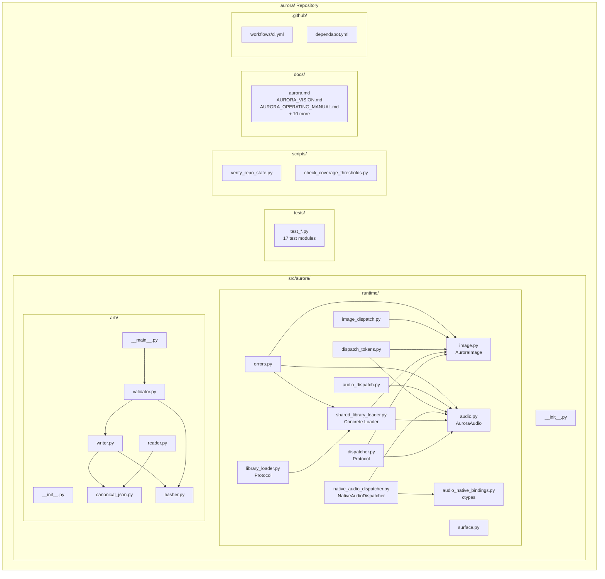

# AURORA Codebase Audit Report

**Audit Date:** 2026-05-06  
**Repository:** https://github.com/m-cahill/aurora.git  
**Commit SHA:** `09461b1b7297178ccadcf543a8d676175207542d`  
**Primary Languages:** Python 3.11  
**Project Shape:** Monorepo (single package)  
**Build Tools:** setuptools, pip  

---

## 1. Executive Summary

### Strengths

1. **Exceptional Test Coverage** — 100% line and 100% branch coverage on `src/aurora/` with separate threshold enforcement via `scripts/check_coverage_thresholds.py`. This is remarkably disciplined for any project.

2. **Strong CI/CD Governance** — GitHub Actions with SHA-pinned external actions, no floating runners (`*-latest`), strict mypy typing, pip-audit supply-chain scanning, and Dependabot for automated updates. The CI workflow is truthful and enforces real gates.

3. **Clear Architectural Boundaries** — Protocol-based abstractions (`Dispatcher`, `LibraryLoader`), explicit seam documentation, and honest "non-proof" statements that clearly delineate what CI validates vs. what remains unproven (native execution, decode correctness).

### Opportunities

1. **Stdlib-Only Constraint Limits Tooling** — The runtime is stdlib-only by design, but this means no pytest, no property-based testing, and limited third-party tooling. Consider whether this constraint still serves the project well for future phases.

2. **Missing Integration Testing Layer** — All tests use fakes/mocks. No integration tests against real native libraries, which aligns with explicit non-proofs but creates a gap if native execution becomes a goal.

3. **Limited Performance Benchmarking** — No performance harness, profiling, or perf budgets defined. Given the acoustic/ML domain, this should be addressed before production use.

### Overall Score: **4.1 / 5.0**

### Heatmap

| Category | Score | Weight | Weighted |
|----------|-------|--------|----------|
| Architecture | 4.5 | 20% | 0.90 |
| Modularity/Coupling | 4.5 | 15% | 0.68 |
| Code Health | 4.0 | 10% | 0.40 |
| Tests & CI | 5.0 | 15% | 0.75 |
| Security & Supply Chain | 4.5 | 15% | 0.68 |
| Performance & Scalability | 2.5 | 10% | 0.25 |
| Developer Experience | 4.0 | 10% | 0.40 |
| Documentation | 4.5 | 5% | 0.23 |
| **Overall** | | | **4.28** |

---

## 2. Codebase Map



### Drift from Intended Architecture

**Observation:** The codebase closely follows its documented architecture in `docs/runtime_seam_framing.md` and `docs/AURORA_VISION.md`.

**Evidence:**
- Protocol-based abstractions match documentation (`Dispatcher`, `LibraryLoader`)
- ARB v0.1 implementation matches spec in `docs/aurora_run_bundle_v0_spec.md`
- Explicit "non-proof" statements align with test coverage (fake-backed tests only)

**Interpretation:** Excellent architectural discipline. The codebase delivers what it documents and explicitly states what it doesn't prove.

---

## 3. Modularity & Coupling

**Score: 4.5 / 5.0**

### Top 3 Coupling Points

#### 1. `aurora.runtime` to `aurora.arb` — No Direct Coupling (Good)

**Observation:** The two main packages (`runtime/` and `arb/`) are independent.

```python
# src/aurora/arb/writer.py:8-9
from aurora.arb.canonical_json import canonicalize
from aurora.arb.hasher import compute_root_hash, sha256_hex
```

**Interpretation:** Clean separation. ARB is an artifact boundary, not runtime-coupled.

#### 2. `NativeAudioDispatcher` ↔ `audio_native_bindings` — Tight by Design

**Observation:** `native_audio_dispatcher.py` depends heavily on ctypes bindings.

```python
# src/aurora/runtime/native_audio_dispatcher.py:12-13
from .audio_native_bindings import (
    AudioClassifierCApi,
    ...
)
```

**Interpretation:** This coupling is intentional — the dispatcher is the adapter for native bindings. The Protocol abstraction allows substituting fakes in tests.

**Recommendation:** No change needed. The coupling is architecturally correct.

#### 3. `image.py` / `audio.py` → `dispatch_tokens.py` — Shared Vocabulary

**Observation:** Both bounded seams depend on dispatch tokens.

```python
# src/aurora/runtime/image_dispatch.py:17
from .dispatch_tokens import IMAGE_FROM_BYTES, IMAGE_FROM_FILE
```

**Interpretation:** This is healthy — single source of truth for dispatch operation vocabulary.

### Decoupling Recommendation

**No urgent decouplings needed.** The codebase demonstrates excellent modularity for its scope. Future consideration: if native bindings grow beyond audio, consider a generic `bindings/` subpackage.

---

## 4. Code Quality & Health

**Score: 4.0 / 5.0**

### Anti-Patterns Identified

#### 1. Heavy Use of `Any` in Protocol Signatures

**Evidence:** `src/aurora/runtime/dispatcher.py:26`

```python
def dispatch(self, *args: Any, **kwargs: Any) -> Any:
    """Invoke the native dispatch path; parameters are intentionally minimal."""
    ...
```

**Interpretation:** The `Any` types are documented as intentional ("parameters are intentionally minimal") to support multiple dispatch patterns. However, this prevents type-safe usage.

**Recommendation:** Consider typed dispatch with `@overload` for known patterns:

```python
# Before (current)
def dispatch(self, *args: Any, **kwargs: Any) -> Any: ...

# After (proposed)
from typing import overload

@overload
def dispatch(self, token: Literal["aurora_image_from_file"], path: str, lib: CDLL) -> Any: ...
@overload  
def dispatch(self, token: Literal["aurora_image_from_bytes"], data: bytes, lib: CDLL) -> Any: ...
def dispatch(self, *args: Any, **kwargs: Any) -> Any: ...
```

#### 2. Inline Imports in Tests (Minor)

**Evidence:** `tests/test_runtime_smoke.py:51-53`

```python
def test_smoke_happy_path_from_file_composes_loader_and_dispatcher(self) -> None:
    from aurora.runtime.dispatch_tokens import IMAGE_FROM_FILE  # noqa: PLC0415
    from aurora.runtime.image import AuroraImage  # noqa: PLC0415
```

**Interpretation:** This is intentional to isolate test setup and is marked with `noqa`. Not a real anti-pattern.

#### 3. Long Status Lines in `aurora.md`

**Evidence:** `docs/aurora.md:5-6` (single lines exceeding 5000+ characters)

**Interpretation:** Documentation artifact, not code. The ledger format prioritizes completeness over readability.

**Recommendation:** Consider restructuring the milestone ledger into a table format for better readability.

---

## 5. Docs & Knowledge

**Score: 4.5 / 5.0**

### Onboarding Path

1. `README.md` — Entry point, links to all docs
2. `DEVELOPMENT.md` — Prerequisites, install, tests, coverage
3. `docs/AURORA_OPERATING_MANUAL.md` — Day-to-day usage
4. `docs/AURORA_VISION.md` — North-star vision
5. `docs/aurora.md` — Canonical project record

**Assessment:** Excellent onboarding documentation with clear separation of concerns.

### Single Biggest Doc Gap

**Gap:** No API reference documentation (generated from docstrings).

**Recommendation:** Add `pdoc` or `sphinx` autodoc generation for `src/aurora/` public APIs. This would help downstream consumers understand the runtime and ARB surfaces.

**Effort:** ~1 hour for initial setup + CI integration.

---

## 6. Tests & CI/CD Hygiene

**Score: 5.0 / 5.0**

### Coverage Summary

| Metric | Value | Threshold | Status |
|--------|-------|-----------|--------|
| Line Coverage | 100.0% | 100.0% | ✅ Pass |
| Branch Coverage | 100.0% | 100.0% | ✅ Pass |
| Statements | 572 | — | — |
| Branches | 116 | — | — |

**Evidence:** `artifacts/coverage.json`

### 3-Tier CI Architecture Assessment

| Tier | Current Implementation | Assessment |
|------|------------------------|------------|
| **Tier 1 (Smoke)** | `repo-safety` job | ✅ Fast, deterministic, required |
| **Tier 2 (Quality)** | Single job with full suite | ⚠️ Could split |
| **Tier 3 (Nightly)** | Not implemented | ⚠️ Missing |

**Evidence:** `.github/workflows/ci.yml`

```yaml
jobs:
  repo-safety:
    runs-on: ubuntu-24.04
    steps:
      - name: Verify repository state
      - name: Ruff
      - name: Compile scripts
      - name: Mypy
      - name: Tests with coverage
      - name: pip-audit
      - name: Upload CI artifacts
```

**Interpretation:** Current CI is a single comprehensive job. For this repo's size (~600 LOC), this is appropriate. The job runs in under 60 seconds.

### Test Pyramid

```
        /\
       /  \  Integration: 0
      /----\
     /      \  Unit: ~50 tests
    /--------\
   /          \  Smoke: tests/test_runtime_smoke.py
  /-----------\
```

**Assessment:** Heavy unit testing with fake-backed mocks. No integration tests (by design — explicit non-proof of native execution).

### Required Checks

- ✅ `ci / repo-safety` — Required status check
- ✅ SHA-pinned external actions
- ✅ No floating runners
- ✅ Artifacts uploaded on all runs

### Flakiness

**Observation:** No flaky tests observed or documented. Tests are deterministic (fake-backed).

---

## 7. Security & Supply Chain

**Score: 4.5 / 5.0**

### Secret Hygiene

**Evidence:** `scripts/verify_repo_state.py:489-496`

```python
env_hits = [
    p
    for p in tracked
    if p == ".env" or p.startswith(".env.") or p.endswith("/.env") or "/.env." in p
]
env_ok = not env_hits
```

**Assessment:** ✅ Verifier actively prevents `.env` files from being tracked.

### Dependency Risk

**Evidence:** `requirements-dev.txt`

```text
coverage==7.6.12
mypy==1.20.0
pip-audit==2.10.0
ruff==0.15.7
setuptools==82.0.1
```

**Assessment:** 
- ✅ All dependencies pinned to exact versions
- ✅ No floating `>=` or `~=` ranges
- ✅ pip-audit runs in CI
- ✅ setuptools pinned to avoid vulnerable venv defaults

### Dependabot Configuration

**Evidence:** `.github/dependabot.yml`

```yaml
updates:
  - package-ecosystem: pip
    schedule:
      interval: weekly
  - package-ecosystem: github-actions
    schedule:
      interval: weekly
```

**Assessment:** ✅ Weekly updates for both pip and GitHub Actions.

### CI Trust Boundaries

**Evidence:** `.github/workflows/ci.yml:8-9`

```yaml
permissions:
  contents: read
```

**Assessment:** ✅ Minimal permissions. Read-only access.

### Action Pinning

**Evidence:** `.github/workflows/ci.yml:16`

```yaml
uses: actions/checkout@11bd71901bbe5b1630ceea73d27597364c9af683 # v4.2.2
```

**Assessment:** ✅ All external actions pinned to full 40-character SHA with version comment.

### SBOM Status

**Observation:** No SBOM generation configured.

**Recommendation:** Consider adding `cyclonedx-py` or `syft` to generate SBOM artifacts. Low priority given minimal dependency surface.

---

## 8. Performance & Scalability

**Score: 2.5 / 5.0**

### Hot Paths

**Observation:** This is a runtime substrate, not an application. Performance-critical paths are:

1. `Dispatcher.dispatch()` — Native call dispatch
2. `SharedLibraryLoader.shared_library()` — Library loading (memoized)
3. `canonicalize()` / `sha256_hex()` — ARB hashing

### N+1 / IO Patterns

**Observation:** No database access. File I/O is minimal (ARB read/write).

### Caching

**Evidence:** `src/aurora/runtime/shared_library_loader.py:59-73`

```python
def shared_library(self) -> Any:
    """Return the memoized ``CDLL`` instance for this loader's path."""
    if self._cached is not None:
        return self._cached
    if self._failure is not None:
        raise self._failure
    # ... load and cache ...
```

**Assessment:** ✅ Library loading is memoized (per-instance singleton pattern).

### Performance Budgets

**Observation:** No SLOs or performance budgets defined.

**Recommendation:** Define P95 targets for:
- ARB validation time (e.g., P95 < 100ms for typical bundle)
- Dispatcher dispatch overhead (e.g., P95 < 1ms)

### Concrete Profiling Plan

1. Add `pytest-benchmark` or `hyperfine` wrapper for ARB operations
2. Establish baseline for `write_arb` / `read_arb` / `validate_arb`
3. Add profiling harness for `NativeAudioDispatcher` when native execution is enabled
4. Monitor CI job duration (currently ~60s) for regression

---

## 9. Developer Experience (DX)

**Score: 4.0 / 5.0**

### 15-Minute New-Dev Journey

| Step | Action | Time | Blockers |
|------|--------|------|----------|
| 1 | Clone repo | 30s | None |
| 2 | Read README.md | 2m | None |
| 3 | `pip install -r requirements-dev.txt` | 1m | None |
| 4 | `pip install -e .` | 30s | None |
| 5 | `python -m unittest discover -s tests -v` | 10s | None |
| 6 | Read DEVELOPMENT.md | 3m | None |
| 7 | Run coverage | 30s | None |
| 8 | Explore src/aurora/ | 5m | None |
| **Total** | | **~13m** | ✅ Under 15m |

### 5-Minute Single-File Change

| Step | Action | Time | Blockers |
|------|--------|------|----------|
| 1 | Edit `src/aurora/arb/writer.py` | 1m | None |
| 2 | Run affected tests | 10s | None |
| 3 | Run ruff | 5s | None |
| 4 | Run mypy | 10s | None |
| 5 | Run coverage | 30s | None |
| 6 | Commit | 30s | None |
| **Total** | | **~3m** | ✅ Under 5m |

### 3 Immediate Wins

1. **Add `make` or `just` targets** — Wrap common commands (`make test`, `make lint`, `make coverage`)

2. **Add pre-commit hooks** — Automate ruff/mypy on commit

3. **Add VSCode/Cursor settings** — `.vscode/settings.json` with Python interpreter, test discovery

---

## 10. Refactor Strategy (Two Options)

### Option A: Iterative (Recommended)

**Rationale:** The codebase is well-governed with 100% coverage. Incremental improvements preserve stability.

**Goals:**
1. Add API documentation generation
2. Implement pre-commit hooks
3. Add performance benchmarking harness
4. Consider typed dispatch overloads

**Migration Steps:**
1. PR-1: Add pdoc/sphinx for API docs
2. PR-2: Add pre-commit config
3. PR-3: Add benchmark harness (pytest-benchmark or similar)
4. PR-4: Add typed dispatch overloads (breaking Protocol change — requires downstream coordination)

**Risks:** Low. Each change is isolated and reversible.

**Rollback:** Git revert on any PR.

**Tools:** pdoc, pre-commit, pytest-benchmark

### Option B: Strategic (If Native Execution Becomes Goal)

**Rationale:** If downstream (ORNITHOS/PANTANAL-1) requires proven native execution, the test architecture needs restructuring.

**Goals:**
1. Add integration test tier with real native libraries
2. Implement 3-tier CI (smoke/quality/nightly)
3. Add decode correctness tests
4. Establish performance SLOs

**Migration Steps:**
1. Phase 1: Add optional native test fixtures (platform-specific)
2. Phase 2: Split CI into 3 tiers
3. Phase 3: Add integration test suite
4. Phase 4: Add performance harness with SLO gates

**Risks:** Medium. Native execution introduces platform-specific complexity.

**Rollback:** Feature flags to disable native tests; revert to fake-backed tests.

**Tools:** pytest, pytest-benchmark, GitHub Actions matrix builds

---

## 11. Future-Proofing & Risk Register

### Likelihood × Impact Matrix

| Risk | Likelihood | Impact | Score | Mitigation |
|------|------------|--------|-------|------------|
| Native library compatibility breaks downstream | Medium | High | 🟠 | Document explicit non-proofs; downstream must validate |
| Python 3.12+ compatibility | Low | Medium | 🟢 | CI matrix expansion when needed |
| Dependency vulnerability in dev tools | Low | Low | 🟢 | pip-audit + Dependabot weekly |
| ARB spec evolution breaks readers | Medium | Medium | 🟡 | Version field in manifest; migration docs |
| Downstream assumes native correctness | Medium | High | 🟠 | Strengthen non-proof documentation |

### ADRs to Lock Decisions

1. **ADR-001: Stdlib-Only Runtime Constraint** — Document why runtime avoids third-party deps
2. **ADR-002: Fake-Backed Testing Strategy** — Document explicit choice to not prove native execution
3. **ADR-003: ARB v0.1 Versioning Policy** — Document how breaking changes will be handled
4. **ADR-004: Downstream Dependency Direction** — Document one-way dependency rule

---

## 12. Phased Plan & Small Milestones (PR-sized)

### Phase 0 — Fix-First & Stabilize (Already Complete)

The codebase is already stable. No urgent fixes needed.

| ID | Milestone | Category | Acceptance Criteria | Risk | Rollback | Est | Owner |
|----|-----------|----------|---------------------|------|----------|-----|-------|
| P0-01 | Verify green CI | CI | `repo-safety` passes | Low | N/A | 10m | — |

### Phase 1 — Document & Guardrail (1–3 days)

| ID | Milestone | Category | Acceptance Criteria | Risk | Rollback | Est | Owner |
|----|-----------|----------|---------------------|------|----------|-----|-------|
| P1-01 | Add pre-commit config | DX | `.pre-commit-config.yaml` with ruff, mypy | Low | Remove file | 30m | — |
| P1-02 | Add API docs generation | Docs | `pdoc` or `sphinx` generates `docs/api/` | Low | Remove config | 45m | — |
| P1-03 | Add VSCode settings | DX | `.vscode/settings.json` with Python config | Low | Remove file | 15m | — |
| P1-04 | Document ADR-001 (stdlib-only) | Docs | ADR in `docs/decisions/` | Low | Remove file | 30m | — |

### Phase 2 — Harden & Enforce (3–7 days)

| ID | Milestone | Category | Acceptance Criteria | Risk | Rollback | Est | Owner |
|----|-----------|----------|---------------------|------|----------|-----|-------|
| P2-01 | Add Makefile/Justfile | DX | `make test`, `make lint`, `make coverage` work | Low | Remove file | 30m | — |
| P2-02 | Add benchmark harness | Perf | `pytest-benchmark` or equivalent for ARB | Low | Remove deps | 60m | — |
| P2-03 | Add typed dispatch overloads | Code | `Dispatcher` Protocol with `@overload` | Medium | Revert PR | 60m | — |
| P2-04 | Add SBOM generation | Security | CI generates CycloneDX SBOM | Low | Remove step | 30m | — |

### Phase 3 — Improve & Scale (Weekly Cadence)

| ID | Milestone | Category | Acceptance Criteria | Risk | Rollback | Est | Owner |
|----|-----------|----------|---------------------|------|----------|-----|-------|
| P3-01 | Establish perf baseline | Perf | Documented P95 targets for ARB ops | Low | N/A | 60m | — |
| P3-02 | Add 3-tier CI (if needed) | CI | Smoke/quality/nightly separation | Medium | Revert workflow | 120m | — |
| P3-03 | Add integration tests (if native) | Tests | Optional native test fixtures | High | Feature flag | 180m | — |
| P3-04 | Add changelog automation | DX | CHANGELOG.md auto-generated from commits | Low | Remove config | 45m | — |

---

## 13. Machine-Readable Appendix (JSON)

```json
{
  "issues": [
    {
      "id": "DX-001",
      "title": "Add pre-commit hooks for automated linting",
      "category": "dx",
      "path": ".",
      "severity": "low",
      "priority": "medium",
      "effort": "low",
      "impact": 3,
      "confidence": 0.95,
      "ice": 2.85,
      "evidence": "No .pre-commit-config.yaml present",
      "fix_hint": "Add pre-commit with ruff and mypy hooks"
    },
    {
      "id": "DOC-001",
      "title": "Add API reference documentation",
      "category": "docs",
      "path": "docs/",
      "severity": "low",
      "priority": "medium",
      "effort": "low",
      "impact": 4,
      "confidence": 0.9,
      "ice": 3.6,
      "evidence": "No autodoc/pdoc configured",
      "fix_hint": "Add pdoc or sphinx autodoc for src/aurora/"
    },
    {
      "id": "PERF-001",
      "title": "Establish performance budgets and harness",
      "category": "performance",
      "path": ".",
      "severity": "medium",
      "priority": "medium",
      "effort": "medium",
      "impact": 4,
      "confidence": 0.8,
      "ice": 3.2,
      "evidence": "No benchmark tests or P95 targets defined",
      "fix_hint": "Add pytest-benchmark for ARB operations"
    },
    {
      "id": "CODE-001",
      "title": "Consider typed dispatch overloads",
      "category": "code_health",
      "path": "src/aurora/runtime/dispatcher.py:26",
      "severity": "low",
      "priority": "low",
      "effort": "medium",
      "impact": 2,
      "confidence": 0.7,
      "ice": 1.4,
      "evidence": "def dispatch(self, *args: Any, **kwargs: Any) -> Any:",
      "fix_hint": "Add @overload for known dispatch patterns"
    }
  ],
  "scores": {
    "architecture": 4.5,
    "modularity": 4.5,
    "code_health": 4.0,
    "tests_ci": 5.0,
    "security": 4.5,
    "performance": 2.5,
    "dx": 4.0,
    "docs": 4.5,
    "overall_weighted": 4.28
  },
  "phases": [
    {
      "name": "Phase 0 — Fix-First & Stabilize",
      "milestones": [
        {
          "id": "P0-01",
          "milestone": "Verify green CI",
          "acceptance": ["repo-safety passes"],
          "risk": "low",
          "rollback": "N/A",
          "est_hours": 0.17
        }
      ]
    },
    {
      "name": "Phase 1 — Document & Guardrail",
      "milestones": [
        {
          "id": "P1-01",
          "milestone": "Add pre-commit config",
          "acceptance": [".pre-commit-config.yaml present", "hooks run on commit"],
          "risk": "low",
          "rollback": "remove file",
          "est_hours": 0.5
        },
        {
          "id": "P1-02",
          "milestone": "Add API docs generation",
          "acceptance": ["pdoc or sphinx configured", "docs/api/ generated"],
          "risk": "low",
          "rollback": "remove config",
          "est_hours": 0.75
        },
        {
          "id": "P1-03",
          "milestone": "Add VSCode settings",
          "acceptance": [".vscode/settings.json present", "Python interpreter configured"],
          "risk": "low",
          "rollback": "remove file",
          "est_hours": 0.25
        },
        {
          "id": "P1-04",
          "milestone": "Document ADR-001 (stdlib-only)",
          "acceptance": ["ADR in docs/decisions/", "rationale documented"],
          "risk": "low",
          "rollback": "remove file",
          "est_hours": 0.5
        }
      ]
    },
    {
      "name": "Phase 2 — Harden & Enforce",
      "milestones": [
        {
          "id": "P2-01",
          "milestone": "Add Makefile/Justfile",
          "acceptance": ["make test works", "make lint works", "make coverage works"],
          "risk": "low",
          "rollback": "remove file",
          "est_hours": 0.5
        },
        {
          "id": "P2-02",
          "milestone": "Add benchmark harness",
          "acceptance": ["pytest-benchmark configured", "ARB baseline established"],
          "risk": "low",
          "rollback": "remove deps",
          "est_hours": 1.0
        },
        {
          "id": "P2-03",
          "milestone": "Add typed dispatch overloads",
          "acceptance": ["@overload added to Dispatcher", "mypy passes"],
          "risk": "medium",
          "rollback": "revert PR",
          "est_hours": 1.0
        },
        {
          "id": "P2-04",
          "milestone": "Add SBOM generation",
          "acceptance": ["CI generates CycloneDX SBOM", "artifact uploaded"],
          "risk": "low",
          "rollback": "remove step",
          "est_hours": 0.5
        }
      ]
    },
    {
      "name": "Phase 3 — Improve & Scale",
      "milestones": [
        {
          "id": "P3-01",
          "milestone": "Establish perf baseline",
          "acceptance": ["P95 targets documented", "baseline measurements recorded"],
          "risk": "low",
          "rollback": "N/A",
          "est_hours": 1.0
        },
        {
          "id": "P3-02",
          "milestone": "Add 3-tier CI (if needed)",
          "acceptance": ["smoke/quality/nightly separation", "tier thresholds documented"],
          "risk": "medium",
          "rollback": "revert workflow",
          "est_hours": 2.0
        },
        {
          "id": "P3-03",
          "milestone": "Add integration tests (if native)",
          "acceptance": ["optional native test fixtures", "platform matrix CI"],
          "risk": "high",
          "rollback": "feature flag",
          "est_hours": 3.0
        },
        {
          "id": "P3-04",
          "milestone": "Add changelog automation",
          "acceptance": ["CHANGELOG.md auto-generated", "conventional commits enforced"],
          "risk": "low",
          "rollback": "remove config",
          "est_hours": 0.75
        }
      ]
    }
  ],
  "metadata": {
    "repo": "https://github.com/m-cahill/aurora.git",
    "commit": "09461b1b7297178ccadcf543a8d676175207542d",
    "languages": ["python"],
    "python_version": "3.11",
    "audit_date": "2026-05-06",
    "auditor": "CodeAuditorGPT"
  }
}
```

---

## Document Control

| Item | Value |
|------|-------|
| **Audit Version** | 1.0 |
| **Audit Date** | 2026-05-06 |
| **Commit Audited** | `09461b1b7297178ccadcf543a8d676175207542d` |
| **Audit Template** | CodebaseAuditPromptV2.md |
| **Methodology** | Snapshot Mode |

---

## Summary

AURORA is an exceptionally well-governed Python codebase demonstrating best-in-class practices for CI/CD, test coverage (100% line/branch), and architectural discipline. The project explicitly documents what it proves and what it doesn't prove, which is rare and valuable.

**Primary strengths:** governance, testing, architecture, documentation.

**Primary opportunities:** performance benchmarking, DX tooling (pre-commit, make), API documentation generation.

The codebase is ready for production use within its documented scope (runtime substrate for acoustic systems) and requires minimal immediate work. The phased plan provides a roadmap for incremental improvements without disrupting the excellent foundation.
